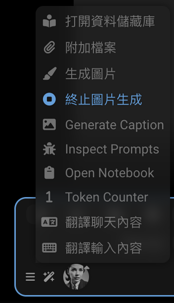
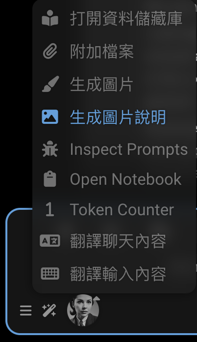
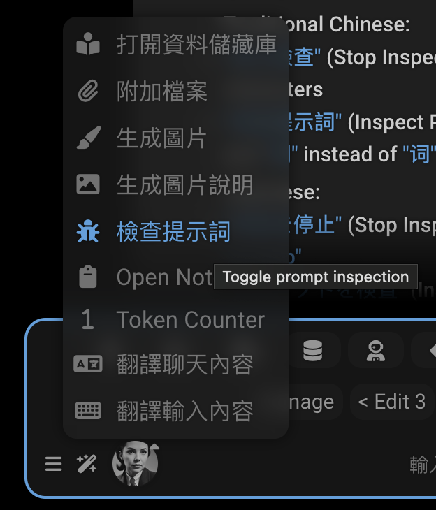

# 国际化 (i18n)

SillyTavern 支持多种语言。本指南解释如何添加和管理翻译。

您可能来到这里是因为某些文本在您的语言中未翻译，这让您感到困扰。首先，我将向您展示我是如何修复繁体中文语言环境中的一些缺失翻译的。每个翻译缺失的原因都不同，这样您就能很好地了解如何修复自己的缺失翻译。

在第二部分，我们将探讨

- SillyTavern 中的 [i18n 工作原理](#翻译的工作原理)，
- [编写翻译](#语言文件)和使用它们的代码，
- [查找缺失翻译](#查找缺失的翻译)的调试功能，
- 添加[新语言](#adding-a-new-language)，
- 以及[贡献您的更改](#contributing)。

如果您正在开发扩展或修改核心代码，请在编写 HTML 和 JavaScript 时考虑 i18n。这样，其他人就可以将您的工作翻译成他们的语言。

没有人能自己掌握 15 种语言。我们一起努力让 SillyTavern 对每个人都可访问。

**世界上的每个人都应该能够在手机和电脑上使用自己的语言。**

--- 

## 让我们修复一些缺失的翻译！

!!! info
这 3 个问题都需要代码更改才能修复。如果您要添加新翻译，可能根本不需要修改代码。只需将翻译添加到 JSON 文件中即可。恰好最近有人向繁体中文 JSON 文件添加了大量缺失的翻译，所以剩下的问题都在代码中。在其他语言环境中，有很多缺失的翻译可以在不修改代码的情况下修复。
!!!

### `Generate Image`

"Generate Image"（生成图像）在繁体中文语言环境中未翻译。为什么？


右键点击元素并检查它。您会看到 HTML：

```html
<!--rendered HTML-->
<div class="list-group-item flex-container flexGap5 interactable" id="sd_gen" tabindex="0">
    <div data-i18n="[title]Trigger Stable Diffusion" title="觸發 Stable Diffusion"
         class="fa-solid fa-paintbrush extensionsMenuExtensionButton"></div>
    <span>Generate Image</span>
</div>
```

它的 `data-i18n` 属性在哪里？它缺失了！让我们添加它。我们在源代码中找到它：

```html
<!--public/scripts/extensions/stable-diffusion/button.html-->
<div id="sd_gen" class="list-group-item flex-container flexGap5">
    <div class="fa-solid fa-paintbrush extensionsMenuExtensionButton" title="Trigger Stable Diffusion"
         data-i18n="[title]Trigger Stable Diffusion"></div>
    <span>Generate Image</span>
</div>
<div id="sd_stop_gen" class="list-group-item flex-container flexGap5">
    <div class="fa-solid fa-circle-stop extensionsMenuExtensionButton" title="Abort current image generation task"
         data-i18n="[title]Abort current image generation task"></div>
    <span>Stop Image Generation</span>
</div>
```

我们很幸运，字符串 `Generate Image` 在许多语言文件中都有，包括繁体中文。


```json
{
    "Generate Image": "生成图片"
}
```

为什么它没有显示出来？我们必须正确连接元素：

```html
<!--public/scripts/extensions/stable-diffusion/button.html-->
<div id="sd_gen" class="list-group-item flex-container flexGap5">
    <div class="fa-solid fa-paintbrush extensionsMenuExtensionButton" title="Trigger Stable Diffusion"
         data-i18n="[title]Trigger Stable Diffusion"></div>
    <span data-i18n="Generate Image">Generate Image</span>
</div>
<div id="sd_stop_gen" class="list-group-item flex-container flexGap5">
    <div class="fa-solid fa-circle-stop extensionsMenuExtensionButton" title="Abort current image generation task"
         data-i18n="[title]Abort current image generation task"></div>
    <span>Stop Image Generation</span>
</div>
```

现在它可以工作了！重新加载页面看看。


但是当我们打开 HTML 时，下面的 `Stop Image Generation` 是怎么回事？HTML 看起来不对。

如果我们生成图像，然后在生成时打开魔杖菜单，我们会看到未翻译的文本。


首先修复 HTML：

```html
<!--public/scripts/extensions/stable-diffusion/button.html-->
<div id="sd_gen" class="list-group-item flex-container flexGap5">
    <div class="fa-solid fa-paintbrush extensionsMenuExtensionButton" title="Trigger Stable Diffusion"
         data-i18n="[title]Trigger Stable Diffusion"></div>
    <span data-i18n="Generate Image">Generate Image</span>
</div>
<div id="sd_stop_gen" class="list-group-item flex-container flexGap5">
    <div class="fa-solid fa-circle-stop extensionsMenuExtensionButton" title="Abort current image generation task"
         data-i18n="[title]Abort current image generation task"></div>
    <span data-i18n="Stop Image Generation">Stop Image Generation</span>
</div>
```

这还不足以解决问题。繁体中文文件中没有"Stop Image Generation"的翻译。我们可以添加它！这是一个可能的翻译：

```json
{
    "Stop Image Generation": "停止生成图片"
} 
```

...我们可以将其添加到 JSON 文件中的"Generate Image"翻译之后。

```json
{
    "Generate Image": "生成图片",
    "Stop Image Generation": "停止生成图片"
} 
```

经过与 Claude 的讨论，我们实际上将使用以下翻译：

- 繁体中文："Stop Image Generation": "終止圖片生成"
- 简体中文："Stop Image Generation": "中止图像生成"
- 日语："Stop Image Generation": "画像生成を停止"



### `Generate Caption`

"Generate Caption"（生成说明）在繁体中文语言环境中未翻译。让我们修复它！


它在哪里？检查元素。

```html
<!--rendered HTML-->
<div id="send_picture" class="list-group-item flex-container flexGap5 interactable" tabindex="0">
    <div class="fa-solid fa-image extensionsMenuExtensionButton"></div>
    Generate Caption
</div>
```

原来这个 HTML 是由 JavaScript 生成的。让我们找到源代码。

```js
// public/scripts/extensions/caption/index.js
const sendButton = $(`
        <div id="send_picture" class="list-group-item flex-container flexGap5">
            <div class="fa-solid fa-image extensionsMenuExtensionButton"></div>
            Generate Caption
        </div>`);
```

我们首先要修复代码：

```js
// public/scripts/extensions/caption/index.js
const sendButton = $(`
        <div id="send_picture" class="list-group-item flex-container flexGap5">
            <div class="fa-solid fa-image extensionsMenuExtensionButton"></div>
            <span data-i18n="Generate Caption">Generate Caption</span>
        </div>`);
``` 

繁体中文文件中也没有"Generate Caption"的翻译。让我们添加它！

```json
{
    "Generate Caption": "生成圖片說明"
}
```

我们将使用以下翻译：

- 繁体中文："Generate Caption": "生成圖片說明"
- 简体中文："Generate Caption": "生成图片说明"
- 日语："Generate Caption": "画像説明を生成"



### `Inspect Prompts`

"Inspect Prompts"（检查提示词）在繁体中文语言环境中未翻译。为什么？
这个有点复杂。文本是由 JavaScript 生成的，而且翻译缺失。

```js
// Extension-PromptInspector/index.js
const enabledText = 'Stop Inspecting';
const disabledText = 'Inspect Prompts';
```

好吧，您知道吗...这两个短语都不在 i18n 文件中。让我们添加它们。

```json
{
    "Stop Inspecting": "停止檢查",
    "Inspect Prompts": "檢查提示詞"
}
```

现在我们必须修复 JavaScript 代码。它必须使用 `t` 函数来获取翻译。

```js
// Extension-PromptInspector/index.js
import {t} from '../../../i18n.js';

const enabledText = t`Stop Inspecting`;
const disabledText = t`Inspect Prompts`;
```

我们从 Claude 那里得到了这些建议。保留字符串，忽略代码。它们必须添加到 JSON 文件中。

```js
// 1. 简体中文 (zh-cn)：
const enabledText = t`停止检查`;
const disabledText = t`检查提示词`;
// 2. 繁体中文 (zh-tw)：
const enabledText = t`停止檢查`;
const disabledText = t`檢查提示詞`;
// 3. 日语 (ja-jp)：
const enabledText = t`検査を停止`;
const disabledText = t`プロンプトを検査`;
```

我们将把这些合并到 JSON 文件中。

```json
{
    "Stop Inspecting": "停止检查",
    "Inspect Prompts": "检查提示词"
}
```

```json
{
    "Stop Inspecting": "停止檢查",
    "Inspect Prompts": "檢查提示詞"
}
```

```json
{
    "Stop Inspecting": "検査を停止",
    "Inspect Prompts": "プロンプトを検査"
}
```



关于那个工具提示很遗憾。问题在于代码没有使用 `t` 函数。

```js
launchButton.title = 'Toggle prompt inspection';
```

我们必须在扩展代码中修复这个问题。

```js
launchButton.title = t`Toggle prompt inspection`;
```

我们还需要将翻译添加到 JSON 文件中。

```json
{
    "Toggle prompt inspection": "切换提示检查"
}
```

```json
{
    "Toggle prompt inspection": "切换提示词检查"
}
```

```json
{
    "Toggle prompt inspection": "プロンプト検査の切り替え"
}
```

提示检查器是一个独立的扩展，所以我们会向该仓库提交代码修复：https://github.com/SillyTavern/Extension-PromptInspector/pull/1

翻译将添加到主 SillyTavern 仓库。https://github.com/SillyTavern/SillyTavern/pull/3198


## 语言文件

每种语言在 `public/locales/` 目录下都有一个以其语言代码命名的 JSON 文件（例如，`ru-ru.json`）。

该文件包含键值对，其中：

- 键是原始英文文本或唯一标识符
- 值是翻译后的文本

示例：

```json
{
    "Save": "Сохранить",
    "Cancel": "Отмена",
    "Could not find proxy with name '${0}'": "Не удалось найти прокси с названием '${0}'"
}
```

## 翻译的工作原理

应用程序中有两种使用翻译的方式：

1. **HTML 元素**：使用 `data-i18n` 属性
   ```html
   <div data-i18n="some_key">默认文本</div>
   ```
   如果有可用的翻译，HTML 中的默认文本将被替换为翻译后的文本。

2. **模板字符串**：在 JavaScript 代码中使用 `t` 函数
   ```javascript
   t`Some text with ${variable}`
   ```
   这些字符串应该在保持 `${0}`、`${1}` 等占位符不变的情况下进行翻译。

SillyTavern 使用带有 `data-i18n` 属性的 HTML 元素来标记可翻译的内容。使用这个属性有几种方式：

### 1. 翻译元素文本

对于简单的文本内容：

```html
<span data-i18n="Role:">Role:</span>
```

```json
{
    "Role:": "Роль:"
}
```

这会将元素的文本内容替换为"Role:"的翻译。

### 2. 翻译属性

要翻译标题或占位符等属性：

```html
<a class="menu_button fa-chain fa-solid fa-fw"
   title="Insert prompt"
   data-i18n="[title]Insert prompt"></a>
```

```json
{
    "Insert prompt": "Вставить промпт"
}
```

`[title]` 前缀指示要翻译哪个属性。属性值的其余部分是将用作 JSON 文件中查找键的文本。程序员通常使用英文文本作为键，但这不是必需的。键可以是任何唯一标识符。

不过，原始英文文本必须存在于相应的属性中（`title="Insert prompt"`）。如果缺少翻译，它将用作后备。最值得注意的是，英语没有翻译文件。

这里是一个使用唯一标识符 `no_items_text` 作为键而不是英文文本的示例：

```html
<!--suppress HtmlUnknownAttribute -->
<div class="openai_logit_bias_list" no_items_text="No items"
     data-i18n="[no_items_text]openai_logit_bias_no_items"></div>
```

```json
{
    "openai_logit_bias_no_items": "没有相关产品"
}   
```

### 3. 每个元素的多个翻译

某些元素需要同时翻译内容和属性，用分号分隔。最常见的模式是同时翻译元素的文本内容和其标题属性：

```html
<div data-source="openrouter" class="menu_button menu_button_icon openrouter_authorize"
     title="Get your OpenRouter API token using OAuth flow. You will be redirected to openrouter.ai"
     data-i18n="Authorize;[title]Get your OpenRouter API token using OAuth flow. You will be redirected to openrouter.ai">
    Authorize
</div>
```

```json
{
    "Authorize": "Авторизоваться",
    "Get your OpenRouter API token using OAuth flow. You will be redirected to openrouter.ai": "Получите свой OpenRouter API токен используя OAuth. У вас будет открыта вкладка openrouter.ai"
}
```

这会翻译：

- 使用键"Authorize"翻译元素的文本内容
- 使用键"Get your OpenRouter API token using OAuth flow. You will be redirected to openrouter.ai"翻译标题属性

注意，`title` 属性和元素的文本内容都以英语提供作为后备。

您也可以翻译多个属性：

```html
<!--suppress HtmlUnknownAttribute -->
<textarea id="send_textarea" name="text" class="mdHotkeys"
          data-i18n="[no_connection_text]Not connected to API!;[connected_text]Type a message, or /? for help"
          placeholder="Not connected to API!"
          no_connection_text="Not connected to API!"
          connected_text="Type a message, or /? for help"></textarea>
```

您的语言文件中相应的翻译看起来像这样：

```json
{
    "Not connected to API!": "Нет соединения с API!",
    "Type a message, or /? for help": "Введите сообщение или /? для помощи"
}
```

当页面加载时，系统会：

1. 查找所有带有 `data-i18n` 属性的元素
2. 解析任何属性前缀，如 `[title]` 或 `[placeholder]`
3. 在您的语言的 JSON 文件中查找每个键
4. 用翻译后的文本替换元素的内容或属性

### 动态文本

对于 JavaScript 代码中的动态文本，翻译使用以下方式之一：

1. 带有 `t` 函数的模板字面量：
    ```javascript
    toastr.warn(t`Tag ${tagName} not found.`);
    ```
2. 直接翻译函数：
    ```javascript
    translate("Some text", "optional_key")
    ```

### 变量占位符

某些字符串包含使用 `${0}`、`${1}` 等的动态值占位符：

```js
toastr.error(t`Could not find proxy with name '${presetName}'`);
```

```json
{
    "Could not find proxy with name '${0}'": "Не удалось найти прокси с названием '${0}'"
}
```

在键和翻译中保持占位符相同。系统将用 `presetName` 的值替换 `${0}` 等。

## 查找缺失的翻译

如果您不仅想修复某个特定的翻译问题，而是希望全面查找并修复所有缺失的翻译，这无疑是一个更具挑战性的任务。

虽然修复单个翻译已经很有价值，但若您希望系统性地解决所有翻译缺失问题，您将需要借助专门的工具来完成这项工作。

### SillyTavern-i18n

https://github.com/SillyTavern/SillyTavern-i18n

用于处理前端本地化文件的工具。

功能：

- 自动从 HTML 文件添加新的待翻译项。
- 从本地化文件中删除缺失的项。
- 使用自动 Google 翻译来自动填充缺失的值。
- 按键对 JSON 文件进行排序。

### Inbuilt debug functions

这些工具位于 <i class="fa-fw fa-solid fa-user-cog"></i> **用户设置** > **调试菜单** 下。

#### 获取缺失的翻译

检测当前语言环境中缺失的本地化数据，并将数据输出到浏览器控制台。如果当前语言环境是英语，则搜索所有其他语言环境。

控制台将显示一个缺失翻译的表格，包含：

- key：需要翻译的文本或标识符
- language：您当前的语言代码
- value：需要翻译的英文文本

#### 应用语言环境

重新应用当前选择的语言环境到页面

!!! warning 这两个工具都不是完美的

- 它们无法捕获 JavaScript 代码中缺失的翻译
- 它们无法捕获 HTML 中缺失的 data-i18n 属性，它们只能捕获未翻译的键
- `getMissingTranslations` 的代码中存在错误：键不应该带有 `[title]` 或 `[placeholder]` 前缀
  !!!

## Adding a new language

要添加对新语言的支持：

1. 将您的语言添加到 `public/locales/lang.json`：

   ```json
   {
     "lang": "xx-xx",
     "display": "语言名称（英文名称）"
   }
   ```

2. 创建 `public/locales/xx-xx.json` 并添加您的翻译

## Contributing

当您的翻译准备就绪时：

1. 验证您的 JSON 文件是否有效
2. 在应用程序中进行彻底测试
3. 通过 GitHub 拉取请求提交
