# Chat Translation (聊天翻译)

## 概述

聊天翻译扩展使用各种翻译提供商实现聊天消息在不同语言之间的实时翻译。它支持手动和自动翻译模式。

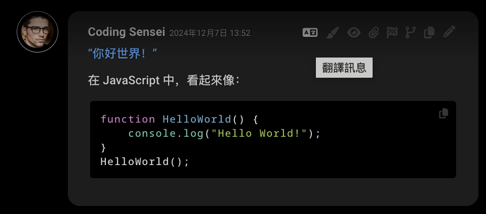

+++ English
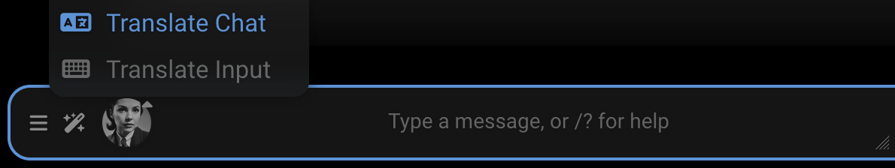
+++ 简体中文
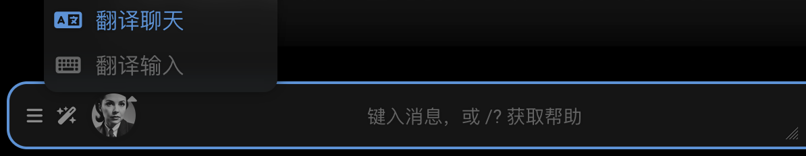
+++ 繁體中文
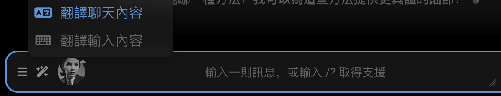
+++ 한국어
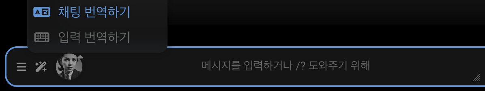
+++ Русский
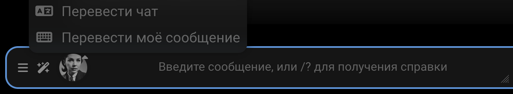
+++

## 使用方法

翻译聊天消息的所有方式：

**<i class="fa-solid fa-language"></i> 翻译聊天**按钮在**<i class="fa-solid fa-magic-wand-sparkles"></i>
扩展**菜单中

- 一次性翻译整个聊天历史

**<i class="fa-solid fa-keyboard"></i> 翻译输入**按钮在**<i class="fa-solid fa-magic-wand-sparkles"></i>
扩展**菜单中

- 仅翻译当前输入文本
- 在发送消息前很有用

**<i class="fa-solid fa-language"></i> 翻译消息**图标在任何消息的**<i class="fa-solid fa-ellipsis"></i> 消息
操作**工具栏中

- 点击仅翻译该消息
- 再次点击恢复原文

**自动模式**配置在**<i class="fa-solid fa-cubes"></i>
扩展**面板的**聊天翻译**抽屉中

- 自动翻译用户输入、AI 回复或两者

**/translate** 斜杠命令

- 使用 `/translate [target=language_code] text` 翻译文本

## 配置

配置选项在**<i class="fa-solid fa-cubes"></i>
扩展**面板的**聊天翻译**抽屉中。

#### 提供商

- 选择您偏好的[翻译服务](#翻译提供商)
- 如果出现**<i class="fa-solid fa-key"></i> API 密钥**图标，点击输入 API 密钥
- 如果出现**<i class="fa-solid fa-link"></i> 自定义 URL**图标，点击输入自定义 API URL

#### 目标语言

选择您想要用来写消息或阅读 AI 回复的语言。

#### 自动模式

配置自动翻译行为。

- **无**：不自动翻译
- **翻译回复**：自动将 AI 回复翻译成目标语言
- **翻译输入**：自动将用户输入翻译成英语
- **全部翻译**：翻译用户输入和 AI 回复

#### 清除翻译

**<i class="fa-solid fa-trash-can"></i> 清除翻译**按钮移除当前聊天中所有消息的翻译。原始消息会保留。

### 配置示例：中英聊天

要设置一个让说中文的用户可以用中文与使用英语的 AI 聊天的工作流程：

1. 将自动模式设置为"全部翻译"
2. 将目标语言设置为"中文（简体）"或"中文（繁体）"
3. 选择具有良好语言自动检测功能的翻译提供商（例如 Google 或 DeepL）

此设置将：

- 将用户的中文输入翻译成英语供 AI 使用
- 将 AI 的英语回复翻译回中文供用户使用

此设置依赖于输入的自动语言检测。为了更精确的控制，未来的更新可能会包括明确的源语言选择。

## 翻译提供商

**:icon-cloud:** 云端
**<i class="fa-solid fa-link"></i>** 本地，自定义 URL
**<i class="fa-solid fa-key"></i>** 需要 API 密钥

| 提供商                                                            | 位置                                                                      | 特点                                                                                               |
|---------------------------------------------------------------------|-------------------------------------------------------------------------------|--------------------------------------------------------------------------------------------------------|
| [Libre Translate](https://libretranslate.com/)                      | :icon-cloud: <i class="fa-solid fa-key"></i> <i class="fa-solid fa-link"></i> | 专有翻译服务的自托管（AGPL-3.0）替代品，带有云托管的专业版     | 
| [Google Translate](https://cloud.google.com/translate)              | :icon-cloud:                                                                  | 使用广泛，支持多种语言，准确度高                                                    |
| [Lingva Translate](https://lingva.ml/)                              | <i class="fa-solid fa-link"></i>                                              | Google Translate 的替代前端，开源（AGPL-3.0），注重隐私                    |
| [DeepL](https://www.deepl.com/)                                     | :icon-cloud: <i class="fa-solid fa-key"></i>                                  | 高质量翻译，尤其是欧洲语言                                           |
| [DeepLX](https://github.com/OwO-Network/DeepLX)                     | <i class="fa-solid fa-link"></i>                                              | 自托管 DeepL 代理，开源（MIT），免费但代理 DeepL Pro 需要 DeepL API 密钥         |
| [Bing Translator](https://www.bing.com/translator)                  | :icon-cloud:                                                                  | 微软的翻译服务，与 Azure 服务集成                                        |
| [OneRing Translator](https://github.com/janvarev/OneRingTranslator) | <i class="fa-solid fa-link"></i>                                              | Google Translate 和其他提供商的自托管前端，注重隐私，开源（AGPL-3.0） |
| [Yandex Translate](https://translate.yandex.com/)                   | :icon-cloud:                                                                  | 适用于俄语和东欧语言                                                        |

### DeepL 特定配置

- 德语、法语、意大利语、西班牙语、荷兰语、日语和俄语可用正式程度级别
- 通过 [config.yaml](/Administration/config-yaml.md#deepl-配置) 中的 `deepl.formality` 配置

## 斜杠命令

使用 `/translate` 命令进行快速翻译。语法：`/translate [target=language_code] text`。如果未提供目标语言，将使用扩展设置中的值。

### 基本用法

将文本翻译成当前目标语言并在弹出窗口中显示：

```
/translate Welcome to the Tavern | /echo 
```

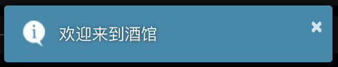

将文本翻译成西班牙语并添加到聊天中：

```
/translate target=es Hello world | /send
```


### 测试、管道翻译、本地化

提示用户输入消息和语言，将消息翻译成该语言，然后重新翻译成配置的目标语言，并在弹出窗口中显示两个翻译。此示例使用 `/input` 和 `/buttons` 命令收集用户输入：

```shell
/input default="Hello, world!" <span data-i18n="Test Message">Sample text</span> | 
/let key=input ||
/buttons labels=["zh-CN", "zh-TW", "es", "hu", "en"] <span data-i18n="UI Language">Language</span> | 
/let key=lang ||
/translate target={{var::lang}} {{var::input}} | /let key=tx_target | 
/translate | /let key=tx_orig ||
/echo escapeHtml=false cssClass=wider_dialogue_popup
<b data-i18n="Test Message">Test message</b>: {{var::input}} <br/>
<b data-i18n="Output">Output</b> ({{var::lang}}): {{var::tx_target}} <br/>
<b data-i18n="Output">Output</b> (<span data-i18n="ext_translate_target_lang">target language</span>): {{var::tx_orig}} <br/>
```

这对于在将翻译写入重要位置之前，检查翻译成您不会说的语言的质量很有用。

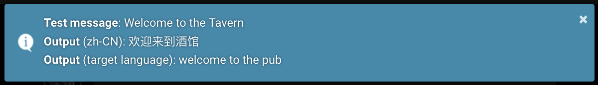
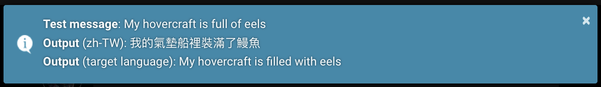

UI 控件以当前语言环境显示，独立于配置的目标语言。

| `/input`                                                                                        | `/buttons`                                                                          |
|-------------------------------------------------------------------------------------------------|-------------------------------------------------------------------------------------|
| 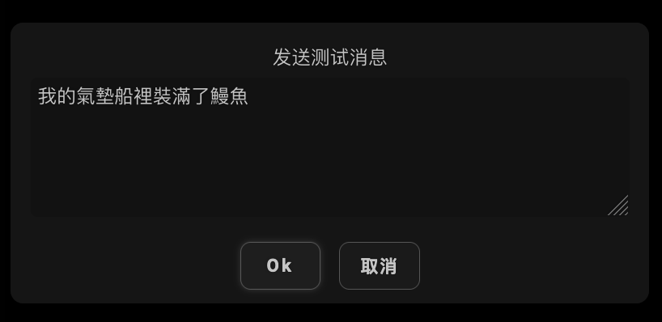 | 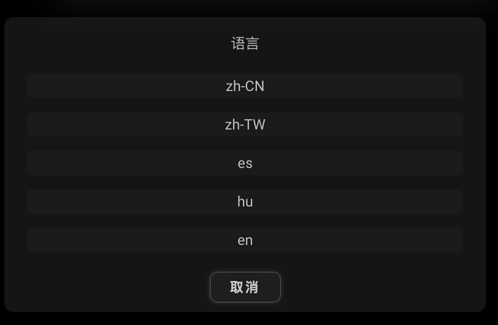 |

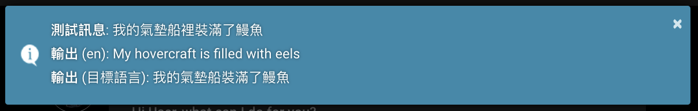

在以下示例中，输入语言检测相对有效：

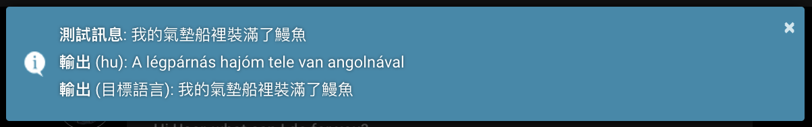
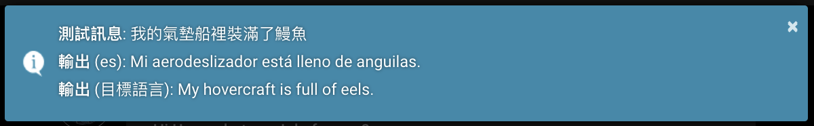
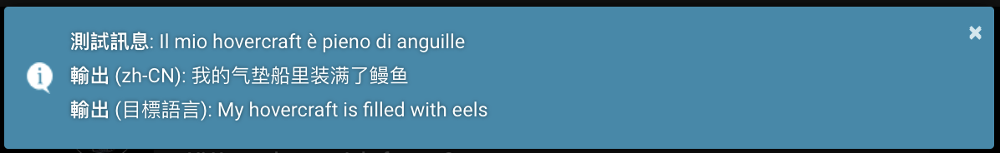

## 技术说明

- 支持 UTF-8 编码、特殊字符和表情符号
- 在需要时通过分块处理大型消息
- 保留消息中的格式和嵌入图像
- 缓存翻译以避免重复的 API 调用

### AI 输入语言

`internal_language` 控制用户消息在发送给 AI 之前自动翻译成的语言。在默认设置中硬编码为'en'，无法通过 UI 更改。因此，发送给 AI 的消息的翻译目标语言始终是英语。之前的测试表明，AI 在接收英语消息时表现更好，但随着更多 LLM 在更多样化的语言数据上训练，这种情况可能会改变。我想可以在 `settings.json` 中更改 `internal_language` 并进行尝试。

### 中文变体处理

扩展支持简体中文和繁体中文，但并非所有翻译提供商都支持。UI 分别将它们显示为"中文（简体）"和"中文（繁体）"，语言代码为'zh-CN'和'zh-TW'。它们被映射到以下翻译提供商的语言代码：

* Libre Translate：'zh-CN'映射到'zh'，'zh-TW'映射到'zt'。
* DeepL 和 DeepLX：两种变体都映射到'ZH'。
* Bing：'zh-CN'映射到'zh-Hans'，'zh-TW'保持不变。
* 其他提供商按原样使用'zh-CN'和'zh-TW'。

### 文本长度限制

一些提供商对每个请求有字符限制：

- Yandex：5000 字符
- DeepLX：1500 字符
- Bing：1000 字符
- Google：5000 字符

较长的文本会自动分块进行翻译。
